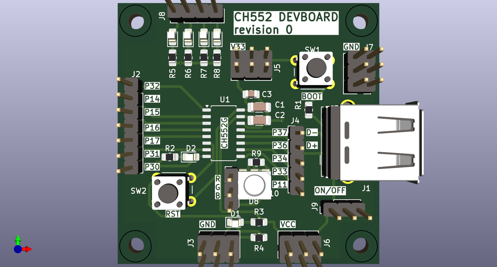

# CH552 DEVBOARD

## Introduction

This is a pcb design for a CH552 DEVOARD. The board is intended to aid in the development of firmware/prototype for the CH552 and CH554 microcontrollers.

## Features

 * 4 led to provide indicators
 * 12x GND pins
 * 6x 3v pins
 * 6x 5v pins
 * ON/OFF button
 * BOOT and RESET buttons

## Part List

|     | Part #        | REF#                   | Package     |
| --- | ------------- | ---------------------- | ----------- |
| 1x  | 10u C         | C3                     | 0805        |
| 2x  | 100n C        | C1, C2                 | 1206        |
| 2x  | 10k Resistor  | R1, R4                 | 0805        |
| 6x  | 1k Resistor   | R2, R3, R5, R6, R7, R8 | 0805        |
| 1x  | Green Led     | D1                     | 0805        |
| 5x  | Leds          | D2, D3, D4, D5, D6     | 0805        |
| 1x  | CH552/CH554   | U1                     | SOP16       |
| 2x  | button        | SW1, SW2               | 6x6x4.3mm   |
| 1x  | USB Connector | J1                     | Male DIP    |
| 1x  | 1x07          | J2                     | 2.54mm pins |
| 1x  | 2x03          | J3, J5, J6, J7         | 2.54mm pins |
| 1x  | 1x05          | J4                     | 2.54mm pins |
| 1x  | 1x04          | J8                     | 2.54mm pins |
| 1x  | 1x03          | J9                     | SS12D00 *   |

\* You can also use a 2.54mm pin header with a jumper cap.

